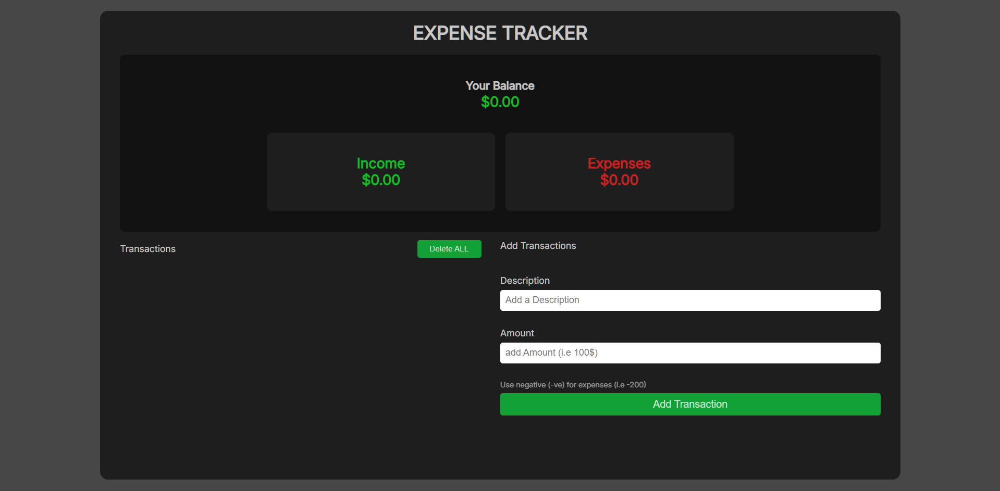

# File: Expense-Tracker/README.md

# 💰 Expense Tracker

A simple, responsive expense tracker to record income and expenses, compute balance in real time, and persist data in the browser with localStorage.

[Deployed App](https://hanzlafullstack-expense-tracker.vercel.app/) • [GitHub Repo](https://github.com/hanzlafullstack/Expense-Tracker)



## Overview

I built this to practice stateful UI, form handling, and client‑side persistence without a backend. The focus is on clear DOM updates, user feedback, and a mobile‑friendly layout that makes adding and reviewing transactions fast and simple.

## Tech Stack

- HTML5 for structure  
- CSS3 for layout and responsive design  
- JavaScript (ES6+) for logic and DOM updates  
- localStorage for persistence across sessions

## Features

- Add income and expense transactions with labels and amounts
- Running totals for income, expenses, and current balance
- Edit and delete individual transactions
- Persist data using localStorage so entries survive page reloads
- Basic validation to prevent empty or invalid submissions
- Mobile‑first, responsive layout

## Folder Structure

```

Expense-Tracker/
│
├── index.html
├── style.css
├── script.js
└── screenshots/
└── preview.png

```


## What Went Well

- Clear separation between reading/writing localStorage and rendering UI
- Predictable updates: one source of truth for totals, derived from transactions
- Snappy UX with instant add/remove and recalculation
- Clean, readable variable names and small helper functions

## What I’d Improve Next

- Stronger validation (e.g., disallow non‑numeric values, large bounds)
- Undo/confirm for deletes (a modal/portal would help here)
- Filtering and search (by type/date/text)
- Import/export data (JSON) and multi‑month summaries
- Basic tests for balance math and list operations

## What I Learned

- Managing derived state (balance from incomes/expenses)
- Designing idempotent rendering (recompute from source, then paint)
- Persisting app data in localStorage with simple serialization
- Keeping functions small and intent‑revealing

## Setup

1. Clone the repo:
   ```bash
   git clone https://github.com/hanzlafullstack/Expense-Tracker.git
   cd Expense-Tracker
   ```
2. Run locally:
   - Open `index.html` directly, or start a simple server:
     ```bash
     npx serve .
     # or
     python -m http.server 5173
     ```
3. Deployed version:
   - https://hanzlafullstack-expense-tracker.vercel.app/

## Notes

- Data is stored in localStorage; use the browser’s devtools to inspect/clear.
- This version is frontend‑only by design; a future version could add a backend, auth, and cloud sync.

## License

For learning and portfolio use.

References:  
- Live: `https://hanzlafullstack-expense-tracker.vercel.app/`  
- Repo: `https://github.com/hanzlafullstack/Expense-Tracker`

